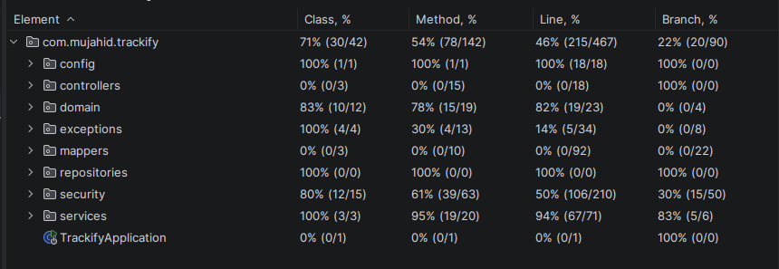

# Trackify

A modern, secure Spring Boot task-management API for organizing task lists, tasks, and user profiles with JWT authentication and OAuth2 login.


---

## 1. Description

Trackify is a backend application designed to help individuals and teams manage personal task lists efficiently. It provides:

- secure user registration and login
- JWT-based authentication
- OAuth2 login support via Google
- built-in rate limiting for auth endpoints
- task list and task CRUD operations
- structured APIs with OpenAPI / Swagger documentation
- containerized deployment with Docker and Docker Compose

It solves the problem of managing tasks in a reliable, testable, and production-ready way with a clean REST API.

## 2. Features

- Secure authentication with JWT and OAuth2
- Full CRUD for task lists and tasks
- Task priority and status updates
- Built-in rate limiting for auth endpoints using Bucket4j + Caffeine
- Flyway-managed database migrations
- Swagger UI for interactive API exploration
- Health and info endpoints for observability
- Dockerized deployment for fast setup

## 3. Tech Stack

| Layer | Technology |
|---|---|
| Language | Java 25 |
| Framework | Spring Boot 4.0.1 |
| Security | Spring Security, JWT, OAuth2 Client |
| Rate limiting | Bucket4j + Caffeine |
| Data | Spring Data JPA, Hibernate, MySQL |
| Migrations | Flyway |
| API Docs | Springdoc OpenAPI / Swagger UI |
| Build Tool | Maven |
| Containerization | Docker, Docker Compose |
| Testing | JUnit 5, Mockito, Spring Test |

## 4. Prerequisites

Before you begin, ensure you have:

- Java 25
- Maven 3.9+
- Docker Desktop (recommended)
- A MySQL-compatible database, or Docker Compose for an instant MySQL container
- Google OAuth2 credentials if you want to use Google sign-in

## 5. Quick Start

### Option A: Docker (recommended)

1. Clone the repository
2. Create a `.env` file in the project root
3. Start the application and database:

```bash
docker compose up --build
```

4. Open the app:
    - Swagger UI: http://localhost:8080/swagger-ui/index.html
    - Health: http://localhost:8080/actuator/health

## 6. Local Development Setup

### Step 1: Clone the repository

```bash
git clone https://github.com/abdulrahman-09/trackify
cd trackify
```

### Step 2: Configure environment variables

Create a `.env` file at the project root with values exposed in `.env.example` file.


### Step 3: Start your database

> Make sure your MySQL instance is running and accessible on the configured port before starting the application.

### Step 4: Run the application

```bash
./mvnw spring-boot:run
```

Once started, the API is available at:

- API: http://localhost:8080
- Swagger UI: http://localhost:8080/swagger-ui/index.html
- Health: http://localhost:8080/actuator/health
### Step 5: Run tests

Once the application is running, you can execute the full test suite:

```bash
./mvnw test
```

## 7. Project Structure

```text
.
├── Dockerfile
├── docker-compose.yml
├── pom.xml
├── src/
│   ├── main/
│   │   ├── java/com/mujahid/trackify/
│   │   │   ├── config/              # OpenAPI and app config
│   │   │   ├── controllers/         # REST endpoints
│   │   │   ├── domain/              # DTOs, entities, enums
│   │   │   ├── exceptions/          # Error handling
│   │   │   ├── mappers/             # MapStruct mappings
│   │   │   ├── repositories/        # Spring Data repositories
│   │   │   ├── security/            # JWT, OAuth2, rate limiting, auth services
│   │   │   └── services/            # Business logic
│   │   └── resources/
│   │       ├── application.properties
│   │       └── db/migration/        # Flyway SQL migrations
│   └── test/
│       └── java/com/mujahid/trackify/  # Unit and integration tests
└── target/                           # Build output
```

## 8. API Endpoints

The application exposes REST endpoints under `/api/v1` and interactive docs through Swagger UI.

### Authentication

| Method | Endpoint | Description |
|---|---|---|
| POST | `/api/v1/auth/register` | Register a new user |
| POST | `/api/v1/auth/login` | Authenticate and receive a JWT |

### Task Lists

| Method | Endpoint | Description |
|---|---|---|
| GET | `/api/v1/task-lists` | List the authenticated user’s task lists |
| GET | `/api/v1/task-lists/{id}` | Fetch one task list |
| POST | `/api/v1/task-lists` | Create a task list |
| PUT | `/api/v1/task-lists/{id}` | Update a task list |
| DELETE | `/api/v1/task-lists/{id}` | Delete a task list |

### Tasks

| Method | Endpoint | Description |
|---|---|---|
| GET | `/api/v1/task-lists/{taskListId}/tasks` | List tasks in a task list |
| GET | `/api/v1/task-lists/{taskListId}/tasks/{taskId}` | Fetch one task |
| POST | `/api/v1/task-lists/{taskListId}/tasks` | Create a task |
| PUT | `/api/v1/task-lists/{taskListId}/tasks/{taskId}` | Update a task |
| PATCH | `/api/v1/task-lists/{taskListId}/tasks/{taskId}/priority` | Update task priority |
| PATCH | `/api/v1/task-lists/{taskListId}/tasks/{taskId}/status` | Update task status |
| DELETE | `/api/v1/task-lists/{taskListId}/tasks/{taskId}` | Delete a task |

### User Profile

| Method | Endpoint | Description |
|---|---|---|
| GET | `/api/v1/user` | Get current user profile |
| PUT | `/api/v1/user` | Update current user profile |
| DELETE | `/api/v1/user` | Delete the current user |

### Observability

| Method | Endpoint | Description |
|---|---|---|
| GET | `/actuator/health` | Basic health status |
| GET | `/actuator/info` | Application info |

## 9. Testing

The project includes unit and integration-style tests covering security, services, DTO validation, and application startup.

Verified locally with:

```bash
./mvnw test
```

Current result: **63 tests passed, 0 failures, 0 errors.**

### Test Coverage



## 10. Deployment

### Docker deployment

This project is ready for container-based deployment using the included `Dockerfile` and `docker-compose.yml`.

Suggested deployment targets:

- Render
- Railway
- Fly.io
- Azure Container Apps
- AWS ECS / Fargate

### CI/CD notes

For continuous delivery, add a pipeline that:

1. runs `./mvnw test`
2. builds the Docker image
3. publishes the image to a registry
4. deploys the container to your target platform


## 11. License

This project is licensed under the MIT License. See the [LICENSE](LICENSE) file for details.

## 12. Contact / Support

Have a question, found a bug, or want to collaborate? Reach out:

- Email: [abdulrahman.mujahid09@gmail.com](mailto:abdulrahman.mujahid09@gmail.com)
- LinkedIn: [linkedin.com/in/abdulrahman-mujahid](https://www.linkedin.com/in/abdulrahman-mujahid/)

